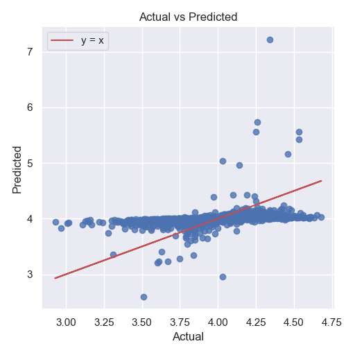

```markdown
# Regression Analysis of Goodreads Data

In our latest exploration of the Goodreads dataset, we've conducted a regression analysis to understand the factors influencing the average book ratings. This analysis dives deep into the relationships between various features such as the count of books, publication year, ratings, and reviews, ultimately aiming to predict the `average_rating`.

## Key Findings from the Analysis

- **Model Performance**:
  - **R² Score**: A mere **5.06%** suggests that our model explains only a small portion of the variance in average ratings. This indicates a weak predictive power.
  - **Mean Absolute Error (MAE)**: **0.179** - On average, our predictions deviate from the actual ratings by this margin, hinting at some room for improvement.
  - **Root Mean Square Error (RMSE)**: **0.241** - This metric further confirms the variability in our predictions.

- **Coefficients Insights**:
  - The coefficients reveal interesting relationships with the features. For instance, the negative coefficient for `ratings_3` and `ratings_5` suggests that as these ratings increase, they tend to have a diminished impact on the average rating prediction.

- **Intercept**: The intercept of approximately **4.00** implies that when all features are at zero, the predicted average rating starts at this baseline.

## Visual Insights: Actual vs Predicted Ratings



### Chart Analysis Summary

1. **Overall Trend**: The linear relationship indicated by the red line shows a positive correlation. As actual ratings increase, so do the predicted values.
   
2. **Distribution of Points**: Most points cluster around lower predicted values (3 to 4.5), suggesting the model's struggle with higher actual ratings.
   
3. **Line of Equality**: The dashed line \(y = x\) shows the ideal scenario of perfect predictions. Points above this line indicate underpredictions, while those below indicate overpredictions.
   
4. **Prediction Errors**: The spread of points, particularly in lower ranges, indicates significant prediction errors for lower actual values.
   
5. **Possible Model Limitations**: The loose grouping around the red line suggests that the model may not fully capture the underlying relationship, indicating potential missing factors.

## Implications of Our Findings

The analysis reveals a **moderate positive correlation** between actual and predicted values, yet the model's performance