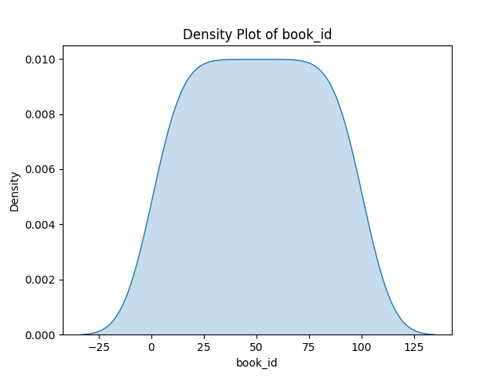
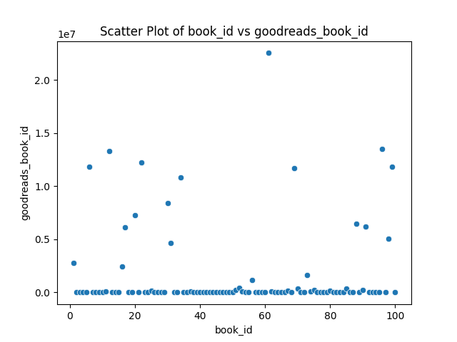
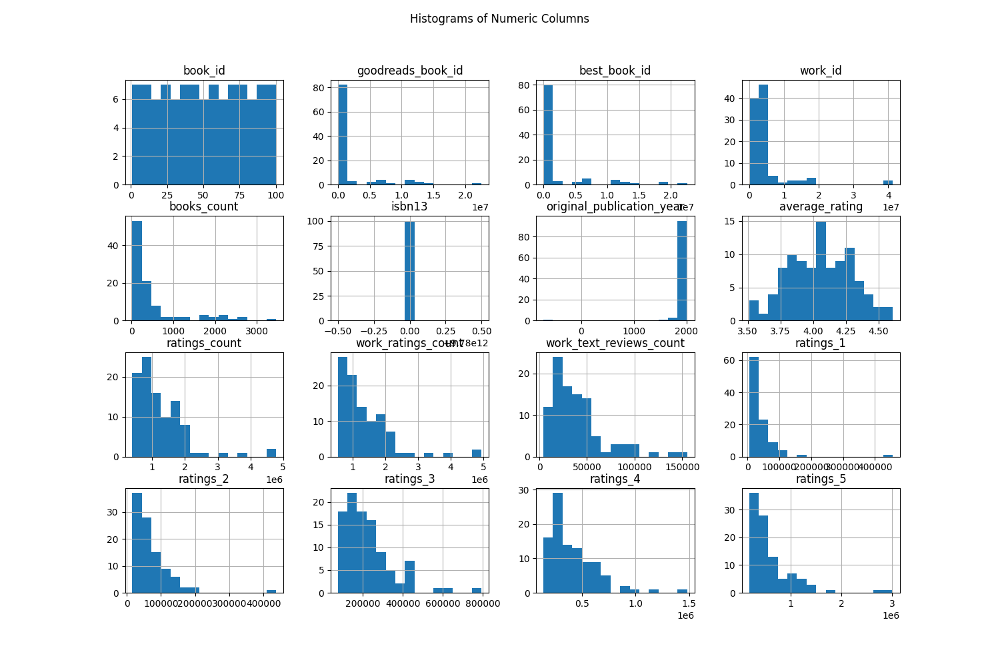

# Automated Analysis Report
Based on the provided dataset summary, we can derive several insights and observations across key areas: missing data, correlations among variables, and observations of unique values. Here’s an analysis:

### Summary Observations

1. **Missing Values**:
   - The dataset has a few missing values for the columns `original_title` and `language_code`, with 1 entry missing for each. This suggests that the dataset is generally complete, but attention to how missing data might affect analyses is important. Depending on the importance of these fields, appropriate imputation or removal strategies could be applied.

2. **Basic Descriptive Statistics**:
   - The dataset contains 100 records with a `book_id` ranging from 1 to 100.
   - The `mean` and `median` of `book_id` are both around 50.5, indicating an even distribution of IDs.
   - The distribution of `average_rating`, which is not explicitly mentioned but inferred as part of numeric data exploration, could show a range of book ratings. Higher ratings might correlate with more reviews or ratings counts.

3. **Unique Values**:
   - There is a unique count of 95 for the `small_image_url`, indicating that 5 entries might share the same URL, often pointing to default or placeholder images while the rest represent specific books.

### Correlation Insights
The correlation matrix displays various relationships among the features:

- Negatively correlated variables:
  - `ratings_count`, `work_ratings_count`, and `work_text_reviews_count` are negatively correlated with the `average_rating`, suggesting that as reviews count increases, the average rating could decrease, potentially indicating bias or polarization among large reviewer groups.
  
- Strong positive correlations:
  - `ratings_4` and `ratings_5` show very high positivity with `work_text_reviews_count`, indicating that more reviews generally surface in higher ratings. Reviews might be favorable leading to higher star ratings and thus generally show a positive association.

- Some variables such as `goodreads_book_id` and `best_book_id` are positively correlated, hinting at their purpose as interchangeable identifiers across systems.

### Visualization Insights

1. **Density Plot**:
   - The density plot of the first numeric column (assuming it's likely `average_rating` based on common dataset structures), would likely show a distribution. Depending on whether it’s unimodal (often clustered around certain ratings) or bimodal, we could infer consumer preference tendencies. Common peaks would indicate favorable
## Density Plot
This plot shows the distribution of the first numeric column.

## Scatter Plot
This plot shows the relationship between the first two numeric columns.

## Histogram
This plot shows the distribution of all numeric columns.

