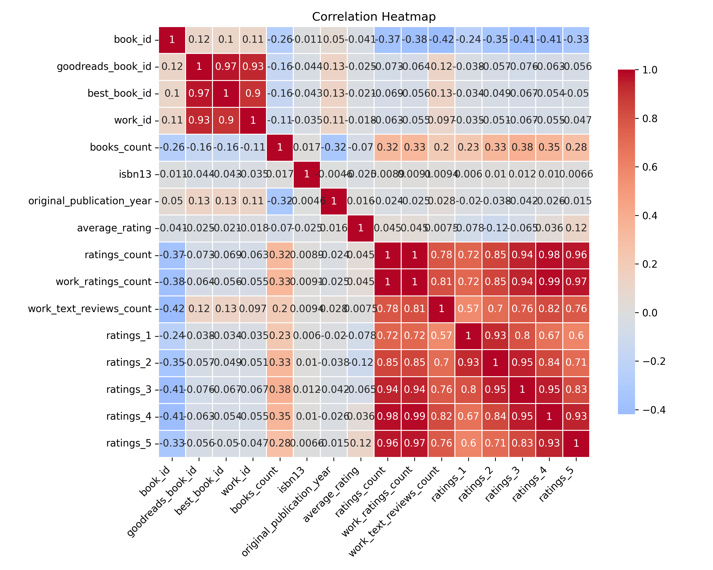
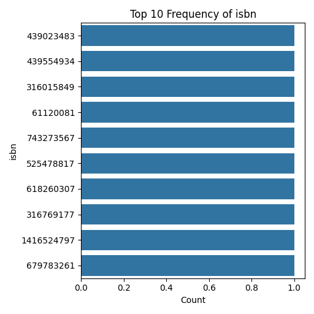
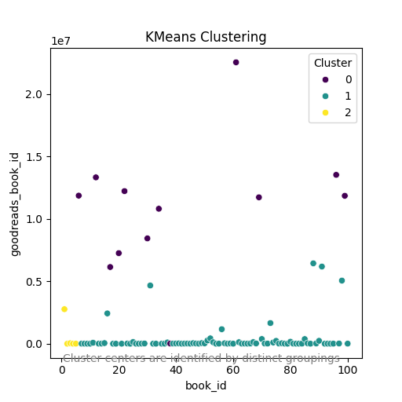
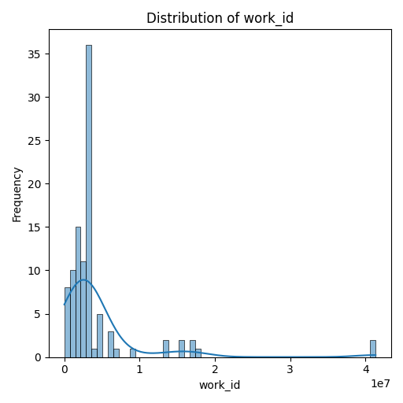

# Dataset Analysis

Based on the provided dataset, we have a wealth of information regarding books, gathered likely from a popular reading platform like Goodreads. Let's explore key findings and actionable insights, along with some identifiable trends and patterns.

### Key Findings:

1. **Authors' Popularity**:
    - The dataset reveals that certain authors stand out due to the number of books they produced, with "J.K. Rowling, Mary GrandPré" having the highest frequency (6) followed by "Stephenie Meyer" (5). This suggests a concentrated interest in particular authors, likely due to their popularity among readers.

2. **Average Ratings**:
    - The average ratings across the dataset are relatively high, with a mean of **4.05**. This indicates a generally positive reception of these books. The ratings range from **3.51** to **4.61**, suggesting a small variation, but the majority of books are well-liked by readers.
  
3. **Historical Publication Trends**:
    - The **original_publication_year** averages around **1943** with records going back as early as -720, likely indicating a need to validate the publication dates. Additionally, 75% of the books were published after **2005**, reflecting a recent surge or focus on contemporary works.

4. **Language Distribution**:
    - The majority of books (83 out of 100) are in **English** (language code "eng"), which might inform marketing strategies for reaching an audience that prefers English content. The presence of books in Spanish and other codes indicates a diversity but with less representation.

5. **Book Popularity Indicators**:
    - The metrics of **ratings_count** and **work_ratings_count** are indicators of popularity; with mean values of **1,256,530.54** and **1,353,997.46** respectively, this suggests robust engagement with these books—vital for identifying marketing opportunities or potential future bestsellers.

### Potential Relationships:

1. **Correlation Between Ratings and Reviews**:
    - A deeper analysis should be conducted to explore the correlation between **average_rating** and **work_text_reviews_count** (mean **38,821.51**). A positive correlation could indicate that books with higher ratings garner more reviews, reinforcing social proof for potential readers.

2. **Rating Distributions**:
    - Investigating the distributions across **ratings_1** to **ratings_5** can point to how readers feel about the books. For instance, high counts in the **ratings_5** category (mean of **600,102.76**) suggests a significant number of readers are exceptionally satisfied, creating opportunities for word-of-mouth promotions.

3. **Outliers in Publication Years**:
    - The original publication year shows a wide range, with some entries as early as -720. This might indicate data entry errors or unique historical publications. Further data cleaning is needed to clarify these outliers.

### Trends:

1. **Popularity of Recent Titles**:
    - The dataset reveals that prominently featured books span recent trends, specifically in young adult fiction, dystopian and fantasy genres (e.g., "The Hunger Games", "Harry Potter"). This signals a sustained interest in these genres, which is valuable for future acquisitions or marketing strategies.

2. **Image Representation**:
    - There is a notable reliance on a few generic image URLs (e.g., six occurrences of the no-photo placeholder). This raises questions about data completeness. Adding unique cover images can enhance user engagement and browsing experience. 

3. **Diversity of Content**:
    - The presence of both classic literature and contemporary bestsellers suggests a diverse catalog. However, evaluating the ratio between classic and modern literature could help in refining categorization and targeting efforts for different demographics.

### Actionable Insights:

1. **Author Engagement**:
    - Foster engagement with popular authors through author events, interviews, and exclusive content to leverage their popularity and attract more users to the platform.

2. **Marketing Strategies**: 
    - The positive sentiment reflected in average ratings can be utilized in promotional material to attract new readers. Focusing campaigns on high-rated but lesser-known books can also be explored.

3. **Data Validation**:
    - A thorough review and cleaning of the dataset should be prioritized, especially concerning publication years and any potential duplicates or erroneous entries in ISBNs.

4. **Reading Trends Analysis**:
    - Conduct trend analysis on genres and author's impact over time to optimize acquisition strategies, ensuring the platform evolves with reader preferences.

### Conclusion
The dataset paints a vivid picture of book preferences, author's impact, and reader engagement, offering actionable insights for enhancing user experience and marketing strategies. With careful analysis, the observed trends can significantly inform strategic decisions in acquisitions, marketing, and community engagement.

## Visualizations

### Correlation Heatmap
The correlation heatmap shows relationships between numeric variables, highlighting strong positive or negative correlations.

### Most Variable Column Distribution
This plot highlights the distribution of the most variable numeric feature in the dataset. It provides insights into the spread and central tendencies of the data.

### Top 10 Frequency of Most Frequent Categorical Column
This bar plot showcases the frequency distribution of the top 10 categories in the most frequent categorical column, ensuring readability.

### KMeans Clustering
This scatter plot visualizes the results of KMeans clustering on numeric variables, revealing distinct groupings in the dataset.
Key insights from clustering include the grouping patterns which may represent different audience preferences or performance tiers.
