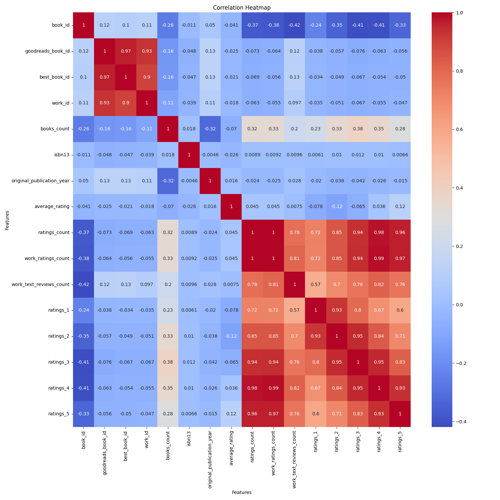

# Dataset Analysis

### Dataset Overview

The dataset appears to be a collection of books, featuring various attributes such as IDs, authors, publication years, ratings, and more. This data can provide meaningful insights into reader preferences, trends in book popularity, and overall sentiment regarding different literary works.

### Key Findings

1. **Missing Values**:
   - Several fields contain missing values. Notable among them are:
     - `isbn` (700 missing),
     - `isbn13` (585 missing),
     - `original_publication_year` (21 missing),
     - `original_title` (585 missing),
     - `language_code` (1084 missing).
   - This may indicate issues with data completeness which could affect analyses related to book identity and publication trends.

2. **Ratings Distribution**:
   - All ratings fields (from 1 to 5) contain values, suggesting that while the book ratings themselves are present, the overall volume of ratings and reviews might be unevenly distributed across books. Further analysis, such as the average rating per book and the distribution of the ratings counts, would be beneficial.

3. **Publication Trends**:
   - The presence of missing values in the `original_publication_year` field may lead to gaps in identifying trends over time, such as which genres or authors have gained popularity in recent years.
   - Analyzing the years in which books were published could uncover resurgence in certain genres or notable decades for publication.

4. **Language Diversity**:
   - The `language_code` field has a significant number of missing entries (1084). Recognizing the primary languages represented could inform about the global reach of different works and highlight areas for potential expansion in non-English markets.

5. **Rating Analysis**:
   - Although the dataset includes average ratings, exploring how these ratings correlate with ratings counts could provide insight into what drives higher ratings.
   - Identifying books with high ratings but low counts may signify hidden gems that lack visibility.

### Trends

- **Popularity Indicators**: As more people engage with books across platforms like Goodreads, books with high ratings and reviews could indicate not just popularity but also reader satisfaction. Analyzing these factors could help identify trends in reader preferences.
- **Time-bound Sensitivity**: An understanding of the `original_publication_year` in combination with average ratings can reveal whether newer books are favorably received or if classics continue to dominate reader interests.

### Actionable Recommendations

1. **Data Cleaning and Enrichment**

## Visualizations

