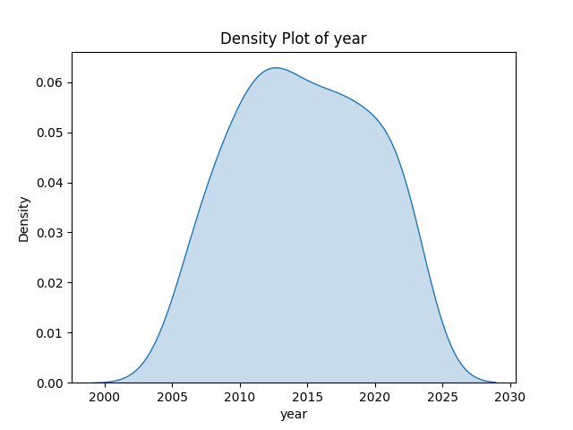
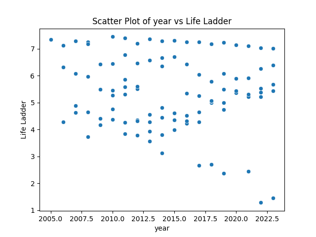
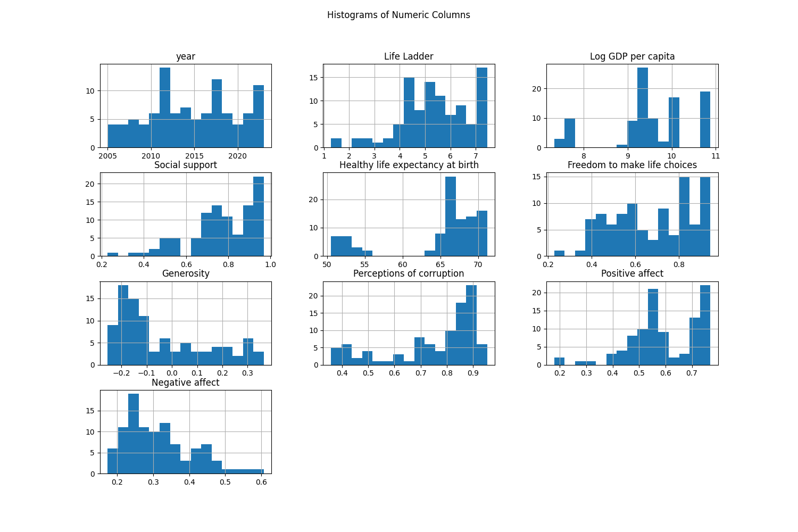

# Automated Analysis Report
Based on the dataset summary provided, here are several insights regarding the data, as well as potential descriptions for the requested visualizations.

### Dataset Insights

1. **Country Representation**: The dataset contains information on 8 unique countries, with a notable concentration in Argentina, which is the most frequently occurring country (18 occurrences).

2. **Temporal Coverage**: The data spans from the year 2005 to 2023, indicating a multi-year evaluation.

3. **Life Ladder & Other Metrics**: The mean value for the "Life Ladder" indicates a general sense of well-being, with the average score being approximately 5.37, suggesting a mixed level of life satisfaction across countries.

4. **Corruption and Affect Correlation**: The correlation matrix shows that "Perceptions of corruption" has a strong negative correlation (-0.644964) with "Life Ladder", implying that higher perceived corruption is associated with lower life satisfaction. Conversely, "Positive affect" is strongly positively correlated (0.894267) with "Life Ladder", which supports the interpretation that happiness or positivity directly contributes to life satisfaction.

5. **Missing Values**: There are some missing values in "Log GDP per capita", "Freedom to make life choices", "Generosity", and measures related to affect and corruption. These might need to be handled through imputation or exclusion during analysis.

### Visualization Insights

1. **Density Plot (First Numeric Column - Life Ladder)**:
   - The density plot for the Life Ladder should illustrate the distribution of life satisfaction scores across the dataset. Given the summary statistics, you might expect a bimodal or unimodal distribution centered around the mean (approximately 5.37), with possible skewness towards higher scores since the maximum is 7.45. Peaks would likely signify higher concentrations of countries at certain life ladder scores. Areas of low density could indicate less common life satisfaction levels among the countries measured.

2. **Scatter Plot (First Two Numeric Columns - Year vs. Life Ladder)**:
   - The scatter plot between "year" and "Life Ladder" might show trends over time, where you might observe rising or stable life satisfaction scores as years progress. Any clustering points close to one another could indicate times when countries had similar satisfaction levels. A regression line (if implemented) would help visualize trends, confirming whether life satisfaction has increased, decreased, or remained stable over this time frame.

3. **Histogram (All Numeric Columns)**:
   - Each numeric
## Density Plot
This plot shows the distribution of the first numeric column.

## Scatter Plot
This plot shows the relationship between the first two numeric columns.

## Histogram
This plot shows the distribution of all numeric columns.

