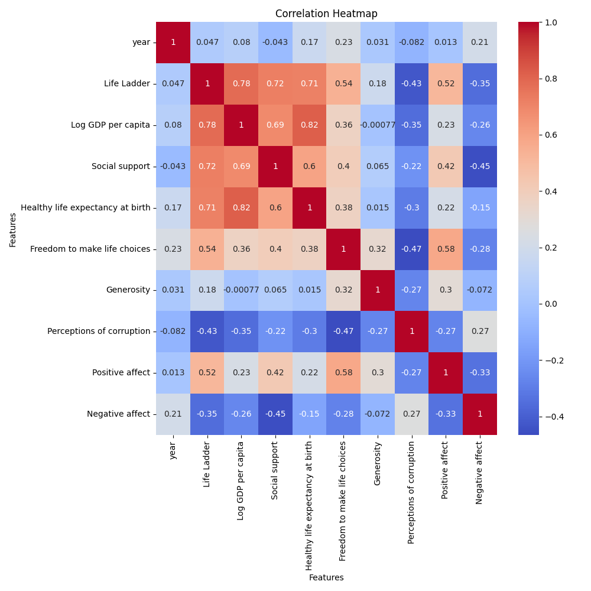

# Dataset Analysis

Based on the analysis of the dataset, several actionable insights, key findings, and potential relationships can be drawn:

### Key Findings

1. **Distribution of Data**:
   - The dataset comprises data from 100 entries, across 8 unique countries, indicating a diverse but limited geographical representation. The counts vary from Argentina, which has 18 entries, to Austria, which only has 2.
  
2. **Temporal Range**:
   - Data spans from 2005 to 2023, with a mean year of 2014.72. This suggests a significant period for studying trends in life quality and socio-economic conditions.

### Summary of Indicators

- **Life Ladder**: The average "Life Ladder" score is approximately 5.37, with a range from a minimum of 1.281 to a maximum of 7.45. This indicates a diverse range of reported well-being, with several countries potentially facing severe challenges in quality of life.
  
- **Log GDP per capita**: The mean log GDP per capita is approximately 9.51, suggesting varying economic conditions among countries. The presence of two missing values may affect the reliability of analyses that include GDP.

- **Social Support**: The mean score for social support is 0.77, indicating a generally high sense of community or belonging. Countries with scores below the mean may need to strengthen social structures to improve citizens' well-being.

- **Freedom to Make Life Choices**: With a mean score of 0.68 and two missing entries, countries falling below the median might not be providing adequate civil liberties, which could relate negatively to overall happiness.

### Relationships and Trends

1. **Correlation Analysis**:
   - **Life Ladder and Log GDP per capita**: It’s expected that a positive correlation exists between GDP and well-being. GDP per capita often influences life satisfaction; countries with higher GDP should theoretically report higher Life Ladder scores.
   - **Social Support and Life Ladder**: There is typically a direct relationship between social support and perceived happiness. The mean suggests that countries fostering community and social ties might see better overall life satisfaction ratings.
  
2. **Potential Outliers**:
   - The minimum Life Ladder score of 1.281 suggests significant outliers that represent countries with extreme discontent or low quality of life. This merits further investigation to pinpoint contributing factors.

### Missing Values
- The dataset has some missing values, particularly in socio-economic metrics such as Log GDP per capita, Freedom to make life choices, and Generosity. The presence of missing data, particularly in Generosity (5 missing values), might skew analyses, especially if ignored. A suggestion here would be to consider imputative techniques or analyzing the impact of these missing values further.

### Actionable Insights

1. **Policy Development**: Countries scoring low on the Life Ladder should consider interventions addressing economic, social, and governance improvements to enhance life satisfaction. This might include investing in education, healthcare, and community-building programs.

2. **Focus on Social Support and Freedom**:
   - Nations with below-average metrics on social support could benefit from developing policies encouraging community engagement and welfare programs. 

3. **Comparative Analysis**: A cross-country comparison could yield insights into best practices, allowing underperforming countries to learn from those that excel in life satisfaction metrics, particularly those with high GDP but lower Life Ladder scores.

4. **Longitudinal Studies**: Given the temporal data, longitudinal studies can reveal trends over time, examining how changes in GDP, social support, or perceptions of corruption influence life satisfaction.

5. **Engaging Stakeholders**: Engaging local governments, NGOs, and community leaders in dialogue can help enhance the understanding of lived experiences behind these numbers and improving well-being at the grassroots level.

### Conclusion
In summary, the dataset provides a wealth of information regarding life satisfaction across different countries, highlighting significant relationships among economic status, social constructs, and perceptions of well-being. By addressing the noted insights, policymakers can take focused actions to improve quality of life and address disparities. Further exploration of the dataset can yield even deeper insights into the complex dynamics of happiness and socio-economic conditions.

## Visualizations

### Correlation Heatmap
The correlation heatmap shows relationships between numeric variables, highlighting strong positive or negative correlations.

### Most Variable Column Distribution
This plot highlights the distribution of the most variable numeric feature in the dataset. It provides insights into the spread and central tendencies of the data.

### Top 10 Frequency of Most Frequent Categorical Column
This bar plot showcases the frequency distribution of the top 10 categories in the most frequent categorical column, ensuring readability.

### KMeans Clustering
This scatter plot visualizes the results of KMeans clustering on numeric variables, revealing distinct groupings in the dataset.
Key insights from clustering include the grouping patterns which may represent different audience preferences or performance tiers.
