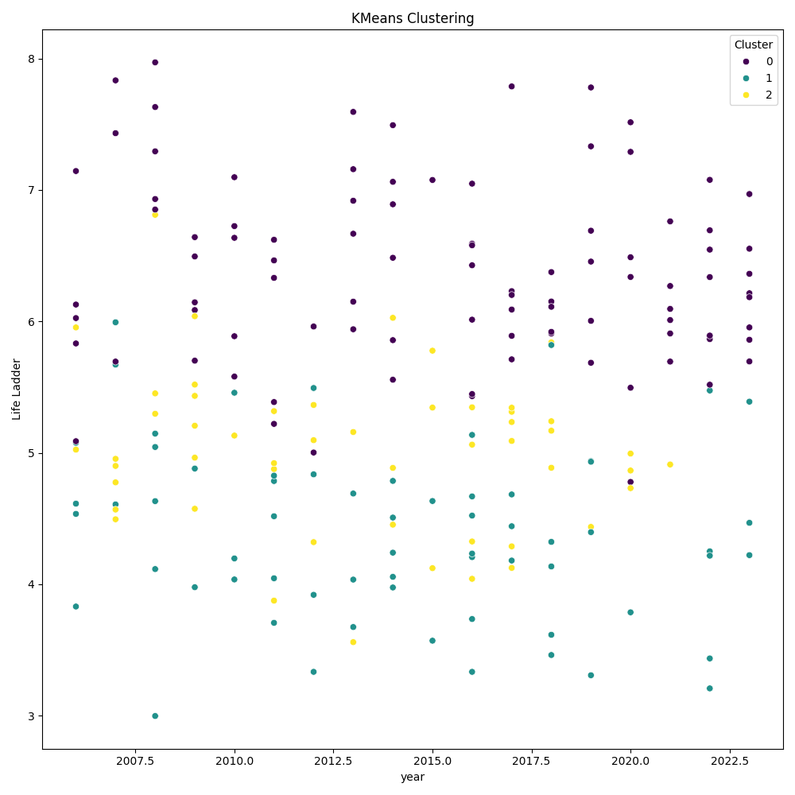

# Dataset Analysis

Based on the provided dataset summary, we can uncover several key insights, trends, and actionable recommendations:

### Key Findings:

1. **Missing Values**: 
   - The dataset has missing values in several columns, notably:
     - **Log GDP per capita**: 28 entries missing.
     - **Social Support**: 13 entries missing.
     - **Healthy Life Expectancy at Birth**: 63 entries missing.
     - **Freedom to Make Life Choices**: 36 entries missing.
     - **Generosity**: 81 entries missing.
     - **Perceptions of Corruption**: 125 entries missing.
     - **Positive Affect**: 24 entries missing.
     - **Negative Affect**: 16 entries missing.
   - The high volume of missing values in "Generosity," "Perceptions of Corruption," and "Healthy Life Expectancy" suggests potential issues in data collection or reporting from specific countries or years.

2. **Key Variables Influencing Life Quality**:
   - **Life Ladder**: This variable is a proxy for individual well-being and is likely influenced by several key factors:
     - **Log GDP per Capita**: A higher GDP per capita typically correlates with improved life satisfaction.
     - **Social Support**: Indicates the network and resources available to individuals, impacting their overall happiness.
     - **Healthy Life Expectancy at Birth**: A significant determinant of life quality; countries with higher healthy life expectancy often report higher life satisfaction.

3. **Generosity and Corruption**:
   - The variability in **Generosity** and **Perceptions of Corruption** among countries can illuminate societal values and governance quality. Higher corruption perception often correlates inversely with life satisfaction, indicating systemic issues affecting residents' mental well-being.

4. **Emotional Well-Being**:
   - **Positive Affect** and **Negative Affect** are essential emotional measures. Understanding the balance between these two can provide insights into citizens’ overall mental health. The dataset indicates a disparity in these measures across different countries.

### Trends:

- **Regional Differences**: Expect to see significant variations in life satisfaction across different regions. Wealthier countries or those with stable governance tend to report higher life ladder scores, while developing nations may grapple with lower scores stemming from economic instability and corruption.
  
- **Temporal Analysis**: If the dataset spans multiple years, analyzing trends over time in variables like GDP per capita and social support could illustrate the impact

## Visualizations

