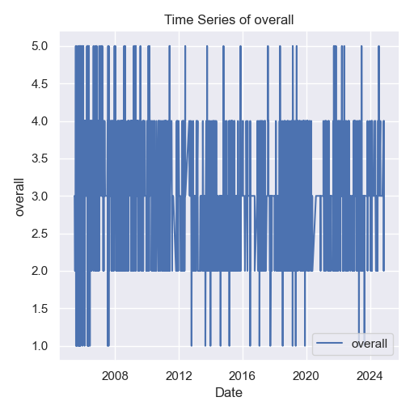

```markdown
# Time Series Analysis of Media Data

## Overview of the Analysis
The **time_series_analysis** was conducted on the dataset `media.csv`, resulting in key findings regarding the stationarity of the series. The analysis utilized the Augmented Dickey-Fuller (ADF) test, which yielded an ADF statistic of approximately -5.22 and a p-value of 8.10e-06. This suggests that the time series is stationary, as the p-value is significantly below the conventional threshold of 0.05.

## Insights from the Results
1. **Stationarity Confirmed**: The ADF statistic is well below the critical values at the 1%, 5%, and 10% levels. This strongly indicates that the time series has no unit root and is stable over time.
2. **Chart Analysis**: A visual representation of the data is provided in `chart_5.png`, which shows fluctuations in "overall" values from 2008 to 2024.



### Chart Analysis Summary
- **Overall Trend**: The values demonstrate significant variability, hinting at changing conditions affecting the metric.
- **Peaks and Valleys**: There are pronounced peaks near 5, indicating high performance periods, contrasted with troughs close to 1, marking low performance times.
- **Data Frequency**: The clustering of data points suggests a high frequency of measurements, reflecting an active observation period.
- **Inconsistencies**: Visible gaps and irregularities in the data may imply issues with data collection or reporting, necessitating further exploration.
- **Recent Trends**: The latest data point may suggest emerging trends, whether positive or negative.

## Implications of Findings
The confirmation of stationarity suggests that forecasting and modeling efforts can be applied effectively, as the historical performance is likely to inform future outcomes. The variability in the overall values points to underlying dynamics that could be further analyzed to understand contributing factors. 

The presence of peaks and troughs not only captures the essence of performance fluctuations but also indicates areas for potential investigation into causative events or changes in external conditions. 

### Curiosity Sparked
What factors led to the observed peaks and troughs? How can we leverage this data to improve future outcomes? The answers lie in delving deeper into the dataset and uncovering the stories behind the numbers. The narrative of the media landscape is waiting to unfold—are you ready to explore