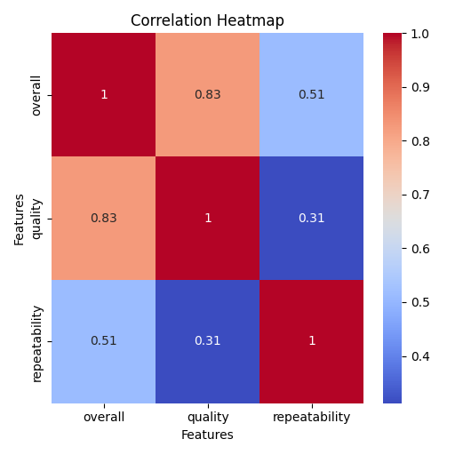
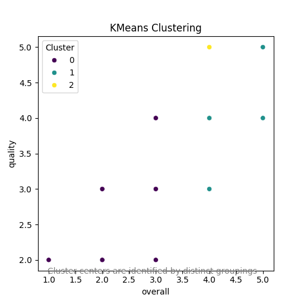
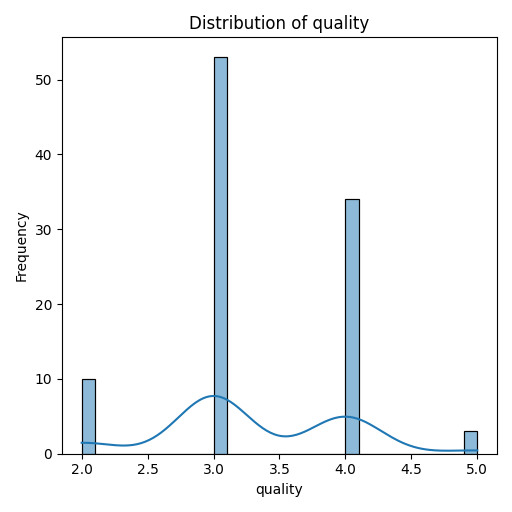
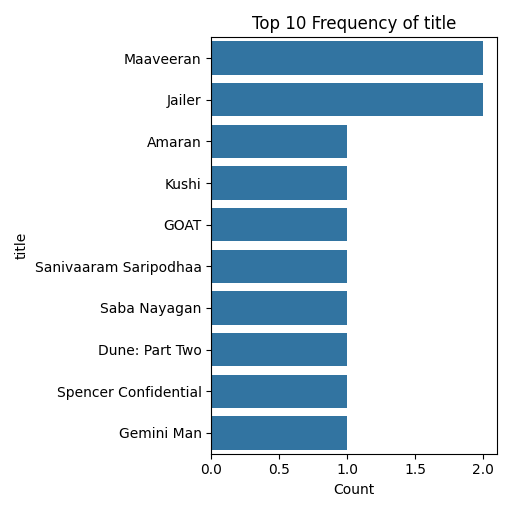

# Dataset Analysis

Based on the dataset analysis provided, here are some actionable insights and key findings that can help in understanding the underlying trends and relationships in the data.

### Key Findings

1. **Date Distribution**:
   - The dataset contains 100 entries spread over 87 unique dates, indicating frequent updates or releases, likely in the entertainment domain (movies/series). The most common date is 15-Jul-23 with 3 entries.
   - There are future dates extending into 2024, potentially highlighting upcoming releases or events.

2. **Language Representation**:
   - A diverse representation of languages is present in the dataset, with **English** (31 entries) and **Tamil** (30 entries) being the most common. This suggests that the dataset covers content from a broad cultural spectrum, indicating a focus on both local (Tamil) and international (English) productions.

3. **Content Type**:
   - A significant focus on **movies** (83 entries) as opposed to series (15 entries) and TV series (2 entries). This trend might suggest that data collection leans towards film releases.
  
4. **Titles**:
   - **"Maaveeran"** and **"Jailer"** are notable titles with the highest frequency (2 entries each). The majority of entries, however, represent unique titles, indicating a varied content landscape.
   - Analyzing titles further through viewer ratings can provide insights into audience preferences and popularity trends of specific genres or actors.

5. **Ratings Analysis**:
   - **Overall Ratings**: The average overall rating is **3.03** with a standard deviation of **0.66**. This suggests a moderate reception across all entries.
   - **Quality Ratings**: The average rating for quality is **3.3**, with a standard deviation of **0.69**. Quality ratings being higher than overall ratings can indicate that viewers may find value in aspects like storytelling and performances, even if they rate the overall experience slightly lower.

6. **Repeatability**:
   - The average repeatability rating stands at **1.3** indicating that most viewers have little desire to rewatch the content, which might hint at lower engagement or satisfaction rates.

### Potential Relationships

- **Language vs. Overall Ratings**: It could be beneficial to analyze the relationship between language and overall ratings. This might help identify if content in certain languages tends to receive higher ratings, influencing distribution strategies.
  
- **Content Type vs. Ratings**: Investigating how different types of content (movie, series, TV series) perform compared to their ratings may reveal preferences in viewer engagement. Are movies being rated significantly higher than series?

- **Actor Contributions**: With multiple entries for actors like **Simon Baker and Robin Tunney**, understanding how their involvement correlates with overall and quality ratings could provide insights into casting effectiveness.

### Outliers

- **Repeatability**: The maximum repeatability rating of **3** might indicate outlier content that viewers found exceptional enough to rewatch. Identifying those specific titles could help in understanding what makes content memorable and popular.

### Trends

- **Overall Low Repeatability and Moderate Ratings**: The dataset suggests that while viewers aren't seeking to rewatch content often, they are giving it moderate ratings. This might indicate room for improving viewer engagement, perhaps through enhanced storytelling or marketing efforts focusing on viewer experiences.
  
- **Focus on Movies**: With the overwhelming number of movies in the dataset, there might be an opportunity to diversify into series or TV series that can build a more dedicated viewer base over time.

### Actionable Insights

- **Target Marketing Campaigns**: Create targeted campaigns focusing on the top-rated titles and actors to boost viewership and engagement.
- **Enhance Viewer Experience**: Given the modest ratings but low repeatability, consider qualitative research (surveys or focus groups) to understand viewer preferences better and refine content offerings.
- **Content Diversification**: Explore the production of content in lesser-represented languages or unique types to tap into a potentially underserved market.

In summary, the dataset provides a rich view into the movie and series landscape, revealing key player activity, viewer engagement, and areas for improvement that could help drive future content strategy and audience interaction.

## Visualizations

### Correlation Heatmap
The correlation heatmap shows relationships between numeric variables, highlighting strong positive or negative correlations.

### Most Variable Column Distribution
This plot highlights the distribution of the most variable numeric feature in the dataset. It provides insights into the spread and central tendencies of the data.

### Top 10 Frequency of Most Frequent Categorical Column
This bar plot showcases the frequency distribution of the top 10 categories in the most frequent categorical column, ensuring readability.

### KMeans Clustering
This scatter plot visualizes the results of KMeans clustering on numeric variables, revealing distinct groupings in the dataset.
Key insights from clustering include the grouping patterns which may represent different audience preferences or performance tiers.
