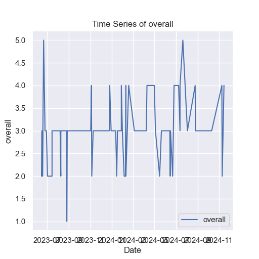

# Time Series Analysis of media.csv

## Analysis Overview
The time series analysis conducted on the dataset `media.csv` aimed to determine the stationarity of the data, which is crucial for effective forecasting and modeling. The Augmented Dickey-Fuller (ADF) test was employed to assess stationarity.

## Key Findings
- **ADF Statistic**: -5.79
- **P-Value**: 4.88e-07
- **Critical Values**: 
  - 1%: -3.50
  - 5%: -2.89
  - 10%: -2.58
- **Stationarity Status**: The series is statistically stationary.

### Insights
1. **Stationarity**: The significantly low ADF statistic and a p-value below the common significance levels (0.01, 0.05, 0.10) indicate that the data does not have a unit root and is stationary.
2. **Data Variability**: The fluctuations in the time series suggest that while the series is stationary, it exhibits variability over time, which could be attributed to various external factors influencing the dataset.

## Chart Analysis Summary

### Observations from the Chart:
1. **Trends Over Time**: The data shows considerable fluctuations, with noticeable spikes and drops throughout the observed period.
2. **High Variation**: Significant peaks indicate periods of heightened activity or performance, suggesting inconsistent underlying factors.
3. **Stability Periods**: Some segments reveal periods of stability, signaling phases of consistency in the data.
4. **Potential Seasonal Effects**: Recurring patterns may suggest underlying seasonal effects or cyclical trends.
5. **Future Considerations**: Identifying the causes of fluctuations is essential for forecasting future trends and aiding decision-making.

## Implications of Findings
- The data's stationarity simplifies modeling and forecasting efforts, as stationary series are easier to work with in time series analysis.
- The observed volatility may necessitate further investigation to comprehend the underlying drivers, which can inform interventions or strategy adjustments.
- Recognizing any seasonal patterns could help in planning and resource allocation, enhancing operational efficiency.

Overall, this analysis illustrates a dynamic environment, highlighting the importance of understanding both the volatility and stability within the dataset for future analysis.