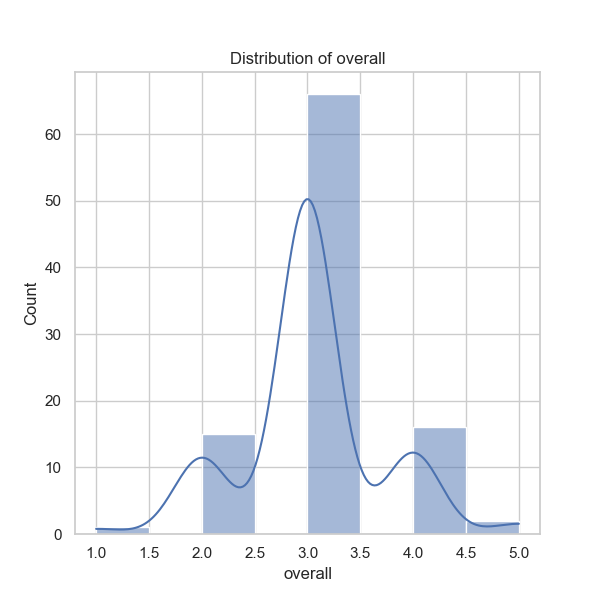
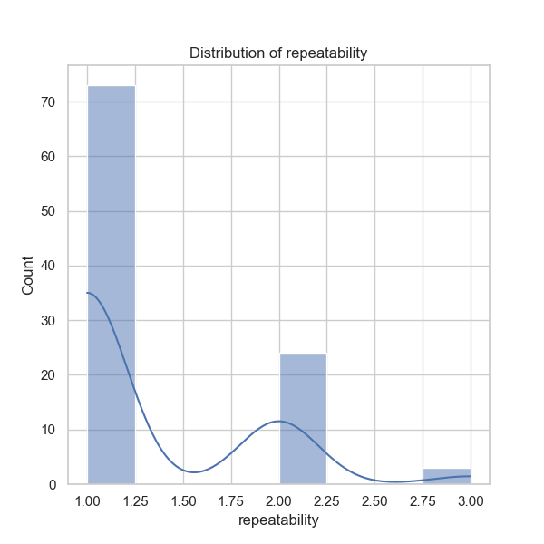

Based on the analysis of the dataset represented in `media.csv`, several insights can be drawn from the summary statistics, missing values, and correlation matrix. Here's a detailed narrative regarding the findings and potential additional analyses.

### Dataset Overview

The dataset contains 100 entries with 8 distinct columns, summarizing various media content. The primary features include:

- **date**: Represents the release date of media.
- **language**: Indicates the language in which the media is produced.
- **type**: Specifies the type of media (e.g., movie, series).
- **title**: The title of the media.
- **by**: Credits the individuals involved in the creation of the media.
- **overall**: An overall rating of the media content (on a scale indicating quality).
- **quality**: Measures the quality of the media, likely on a similar scale as overall rating.
- **repeatability**: Indicates how likely the media is to be enjoyed upon repeated viewing.

### Key Insights

1. **Date Analysis**:
   - There is a total of 87 unique dates with a peak frequency on '15-Jul-23', appearing 3 times. This indicates a possible concentration of releases around mid-July, likely suggesting strategic timing for content release during this period.
   - Further investigation into the distribution of releases over time may reveal seasonal trends.

2. **Language Diversity**:
   - The media is presented in 8 unique languages, with English being the most prevalent, represented in 31 entries. This signifies a strong leaning toward English-language content.
   - Evaluating the relationship between language and ratings may help identify whether certain languages correlate with higher or lower overall ratings.

3. **Content Types**:
   - A predominant category is 'movie', accounting for 83% of the entries. This suggests that the dataset mainly focuses on movies rather than series or other types of media.
   - Exploring viewer ratings and quality assessments based on content types would help understand audience preferences better.

4. **Title Popularity**:
   - Titles are predominantly unique, with only two records for the title "Maaveeran", indicating little repetition and maybe a diverse selection criterion.
   - A deeper dive into the ratings of repeated titles versus unique ones might reveal insights into recognition and audience attachment.

5. **Collaboration Trends**:
   - The column 'by' shows 10 missing values, indicating that not all media can be attributed to specific creators. The most notable entry features a collaboration involving Simon Baker and Robin Tunney, occurring six times.
   - Assessing how collaborative efforts affect ratings can provide insights into the impact of recognizable names on viewer perception.

6. **Ratings Overview**:
   - The overall ratings average 3.03 with a standard deviation of 0.66, suggesting moderate satisfaction with media quality. Similarly, quality ratings average 3.3.
   - The ratings spread suggests a bimodal distribution, with peaks at 1, 3, and 5. Further investigation into each rating group could reveal trends about high-quality and low-quality movies.

7. **Repeatability Ratings**:
   - Repeatability shows a lower average of 1.3, predominantly sitting at 1, indicating that most viewers do not find enough merit in rewatching the content. 
   - Investigating the type of media that receives higher repeatability could yield information on audience loyalty or attachment.

### Correlation Insights

From the correlation matrix:
- There is a strong correlation (0.71) between 'overall' and 'quality', suggesting that higher quality ratings align with better overall ratings.
- A moderate correlation exists between 'overall' and 'repeatability' (0.41), indicating that more highly-rated media tends to be rewatched more often, although the repeatability score is considerably lower.

### Additional Analyses Suggestions

To further enrich the insights from this dataset, the following analyses are recommended:

1. **Clustering Analysis**: Using unsupervised learning techniques like K-means or hierarchical clustering on ratings and characteristics of media (language, type) could help segment the media into distinct groups based on viewer preferences.

2. **Anomaly Detection**: Identifying outlier ratings or trends in language and type that differ significantly from the norm can provide insights into unexpected viewer behavior or preferences.

3. **Temporal Analysis**: Conduct time series analysis to assess trends in releases and ratings over specific timeframes. This could highlight the effectiveness of promotional campaigns and audience engagement following premieres.

4. **Sentiment Analysis**: If additional qualitative data such as reviews or comments can be obtained, performing sentiment analysis could unveil viewer opinions not captured by numeric ratings alone.

5. **Impact of Collaborations**: Analyzing the effect of well-known actors or directors on ratings may reveal the importance of star power in media reception.

By conducting the above analyses, a deeper understanding of viewer preferences, trends, and content quality can be achieved, facilitating more informed decisions for future media projects and marketing strategies.

