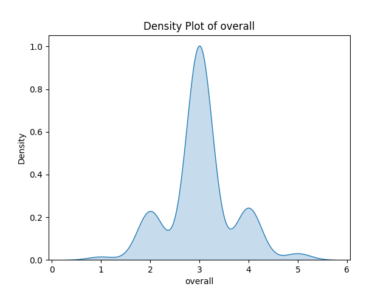
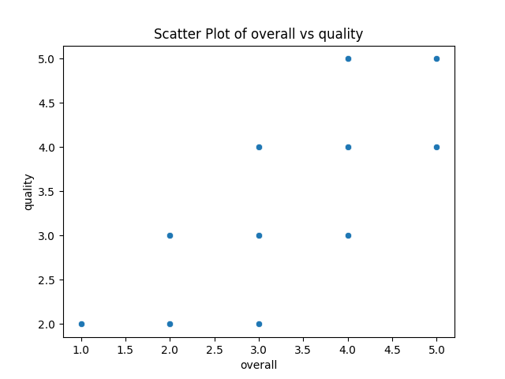
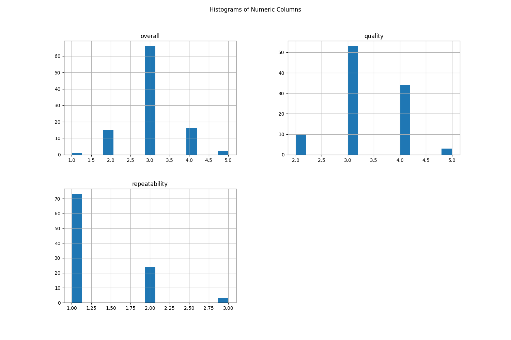

# Automated Analysis Report
Based on the dataset summary provided, we can derive several insights:

### Dataset Overview
- **Total Entries:** The dataset contains 100 entries.
- **Date Information:** The data appears to be from varying dates, with the most frequent date being 15-Jul-23.
- **Language Distribution:** There are 8 unique languages, with English being the most common (31 occurrences).
- **Type of Content:** There are 3 types of content, with the majority being movies (83 occurrences).
- **Titles:** There are 98 unique titles, suggesting diversity in content.
- **Creators:** There are 90 unique creators, with some titles attributed to multiple creators.

### Ratings Analysis
- **Overall Rating:**
  - Mean: 3.03 (on a scale that likely ranges from 1 to 5).
  - The ratings show a moderate spread with a standard deviation of approximately 0.66.
  - The minimum rating is 1.0 and the maximum is 5.0, indicating a positive skew in ratings.
- **Quality Rating:**
  - Mean: 3.30 with a similar standard deviation.
  - Quality ratings range from a minimum of 2 to a maximum of 5.
- **Repeatability:**
  - Mean: 1.30, implying that most items are likely not repeated often.
  - Ranges from 1 to 3, indicating fewer options for repeat viewership or engagement compared to overall and quality ratings.

### Insights from Correlation
- **Overall and Quality Ratings:** There is a strong positive correlation (0.71), suggesting that as the quality rating increases, the overall rating tends to increase as well.
- **Overall and Repeatability:** A moderate correlation (0.41) indicates that higher overall ratings might correlate with some degree of repeatability, though it is not particularly strong.
- **Quality and Repeatability:** A weaker correlation (0.22) implies that quality does not strongly influence repeatability.

### Missing Values
- The dataset has missing data for the "by" column, with 10 entries missing this attribute. This might affect the analysis of content creators.

### Visualization Insights
1. **Density Plot (Overall Rating):**
   - The density plot would likely show a distribution that skews towards the higher end of the rating scale, given the mean is above 3. It would likely indicate that most content is rated between 3 and 4, with fewer
## Density Plot
This plot shows the distribution of the first numeric column.

## Scatter Plot
This plot shows the relationship between the first two numeric columns.

## Histogram
This plot shows the distribution of all numeric columns.

