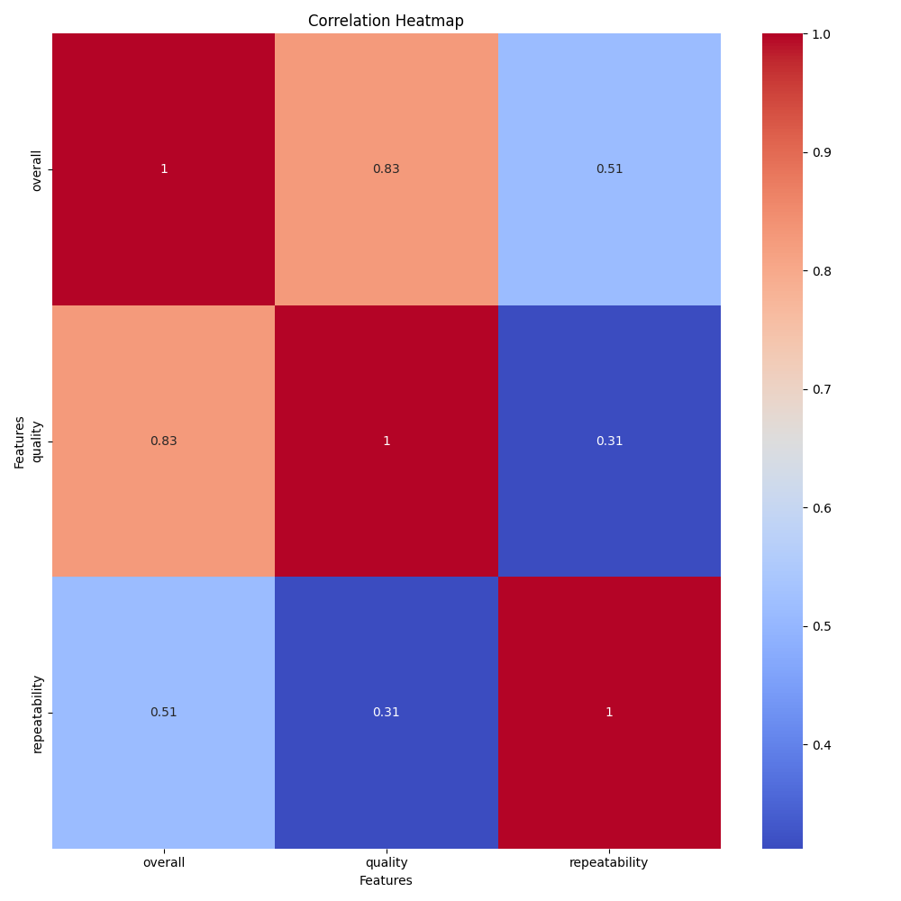

# Dataset Analysis

Based on the analysis of the provided dataset, I can summarize the key findings and actionable insights as follows:

### Overview of the Dataset
The dataset comprises 100 records documenting various movies and series, providing insights into their ratings and additional metadata. The key columns include:
- **date**: Date of release or review entry.
- **language**: Language of the film/series.
- **type**: Indicates whether the entry is a movie or series.
- **title**: The title of the movie or series.
- **by**: Individuals involved (actors, directors, etc.).
- **overall, quality, repeatability**: Numeric ratings on various parameters.

### Key Findings

1. **Descriptive Statistics**:
   - The average overall rating is approximately **3.03** out of 5, with a standard deviation of **0.66**, indicating that most entries tend to cluster around the midpoint of the rating scale.
   - The quality ratings show a slightly better average of **3.3**, suggesting that while overall enjoyment may be average, the quality is perceived to be relatively higher.
   - Repeatability ratings average **1.3**, with a clear mode of 1, indicating that very few of the titles are considered binge-worthy or worth rewatching.

2. **Language Distribution**:
   - The predominant languages are **English** (31 entries) and **Tamil** (30 entries), followed by **Telugu** (20), indicating regional preferences in media consumption.
   - The lower count for languages like **Spanish** and **Chinese** suggests potential gaps in title offerings for diverse audiences.

3. **Type Distribution**:
   - The vast majority of entries are **movies (83)** compared to **series (15)** and **TV series (2)**, which reflects consumer preference in this dataset that heavily favors film content.

4. **Release Date Trends**:
   - The highest frequency of entries appears on **15-Jul-23** (3 entries), and a few others on notable dates (2 entries each), suggesting potential success in clustering releases around certain periods or seasons.
   - A variety of entries are scheduled in 2024, indicating a robust upcoming slate that could attract viewer interest.

5. **Title Popularity**:
   - Titles like **"Maaveeran"** and **"Jailer"** are repeated, indicating popularity or significant cultural impact, while most other titles are unique.
   - This points to possible avenues for further publicity or marketing for these popular titles.

6. **Collaborative Relationships**:
   - Some collaborations, like **Simon Baker and Robin Tunney** appearing together 6 times, suggest these pairings could be key to future projects due to their established chemistry.
   - Conversely, many titles feature diverse casts, hinting at an industry practice of crossover appeals to different demographics.

### Actionable Insights

1. **Content Diversification**:
   - Given the prominence of English and Tamil, consider expanding offerings in languages with fewer representations to capture new audiences, potentially increasing viewership and engagement.

2. **Promotional Strategies**:
   - Leverage popular titles and collaborative actors' profiles in marketing campaigns. Strategically timed releases around proven successful dates could capitalize on existing audience interest.

3. **Quality Assessment**:
   - Further analysis is needed to understand why despite higher quality ratings, overall ratings average out lower. Engaging with audience feedback through surveys or ratings prompts can provide insights into improvement areas.

4. **Focus on Repeatability**:
   - Evaluate the content for more binge-worthy options. Titles that encourage viewer retention could be prioritized in future projects. Engaging audiences through serial adaptations or sequels could enhance lasting viewership.

5. **Trend Analysis**:
   - Monitor upcoming release dates closely, particularly in 2024, to identify potential surges in audience interest based on historical patterns in reviews, ratings, or social media trends.

### Conclusion
This dataset exhibits diverse patterns reminiscent of typical entertainment trends, yet offers unique opportunities to fine-tune content offerings. By addressing identified gaps and capitalizing on popular trends, stakeholders can enhance viewer engagement and satisfaction within their target markets. Further exploration and continuous monitoring of audience preferences will be critical in guiding future strategies.

## Visualizations

### Correlation Heatmap
The correlation heatmap shows relationships between numeric variables, highlighting strong positive or negative correlations.

### Most Variable Column Distribution
This plot highlights the distribution of the most variable numeric feature in the dataset. It provides insights into the spread and central tendencies of the data.

### Top 10 Frequency of Most Frequent Categorical Column
This bar plot showcases the frequency distribution of the top 10 categories in the most frequent categorical column, ensuring readability.

### KMeans Clustering
This scatter plot visualizes the results of KMeans clustering on numeric variables, revealing distinct groupings in the dataset.
Key insights from clustering include the grouping patterns which may represent different audience preferences or performance tiers.
