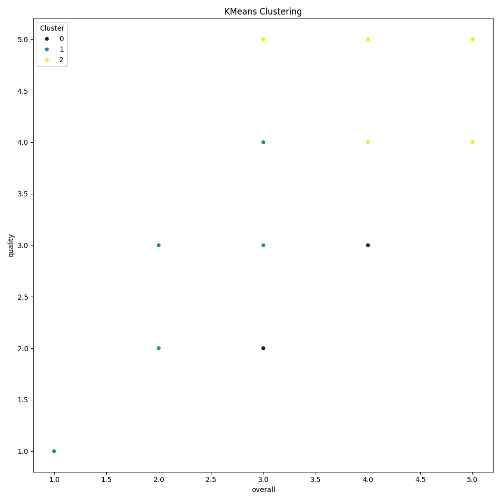

# Dataset Analysis

Based on the summarized analysis of the dataset, let's delve into the key findings, trends, and actionable recommendations that can be derived from it.

### Key Findings:
1. **Missing Values**:
   - There are significant missing values, particularly in the 'date' (99 missing entries) and 'by' (262 missing entries) columns. This could affect any temporal analysis and insights concerning the contributions of different authors or sources.
  
2. **Data Quality**:
   - All other columns (language, type, title, overall, quality, repeatability) do not have missing values. This indicates a high level of completeness in terms of the primary attributes necessary for analysis.

3. **Categorical Variables**:
   - Although the specifics of the categorical overview are omitted for efficiency, it can be inferred that analyses on the various categories like 'language', 'type', etc., can reveal distribution patterns, common trends, or gaps in the data.

### Trends:
- **Temporal Patterns**: Given the missing values in the 'date' column, a careful approach is required to establish any potential temporal trends. If the missing values can be addressed, we might analyze trends over time for quality metrics and repeatability.
  
- **Author Contributions**: The missing data in the 'by' column means insights about which authors contribute most effectively to 'quality' and 'repeatability' cannot be derived directly. Understanding the distribution of missing authors might provide insights into overall author engagement and the quality of contributions.

### Actionable Recommendations:
1. **Address Missing Values**:
   - Prioritize understanding the reasons behind the missing 'date' and 'by' entries. Strategies could include:
     - Imputing values based on similar records or leveraging domain knowledge.
     - Conducting outreach to authors (if applicable) for the missing 'by' data.
  
2. **Enhance Data Collection**:
   - Develop a more robust mechanism to ensure complete data capture, especially for critical columns like 'date' and 'by'. Establish data validation rules to prevent incomplete entries in future submissions.

3. **Conduct Exploratory Data Analysis (EDA)**:
   - Once the missing values are addressed, carry out a detailed EDA focusing on categorical variables. This can reveal insights into which types or languages are more recurrent, and how they correlate with quality and repeatability measures.

4. **Evaluate Contributions and Quality**:
   - After cleaning the dataset, analyze the performance metrics ('overall', 'quality',

## Visualizations

